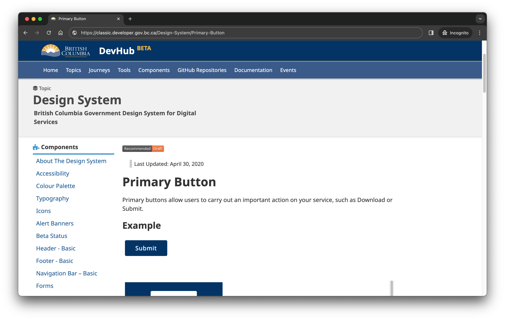
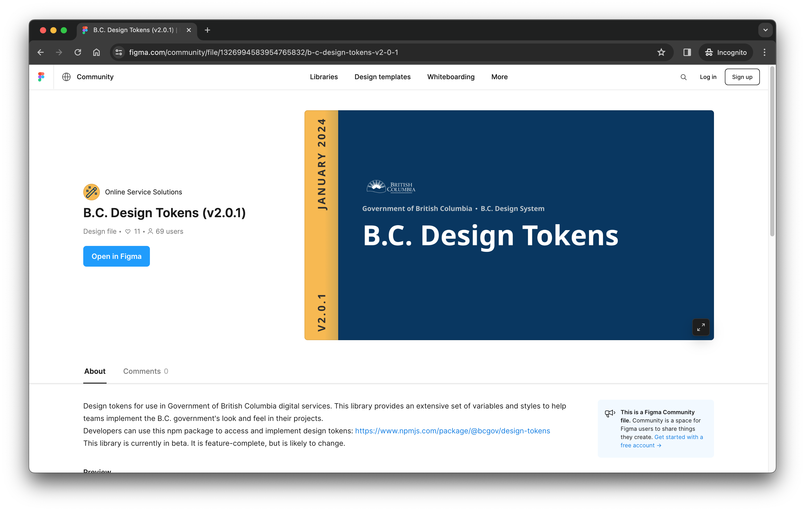
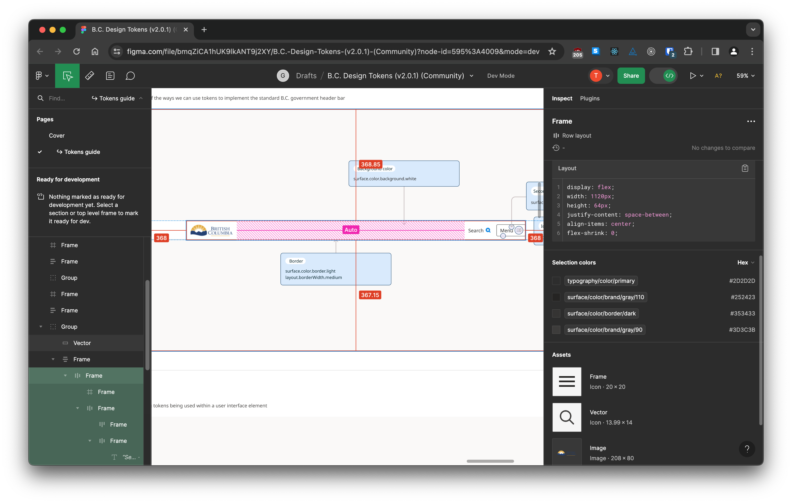
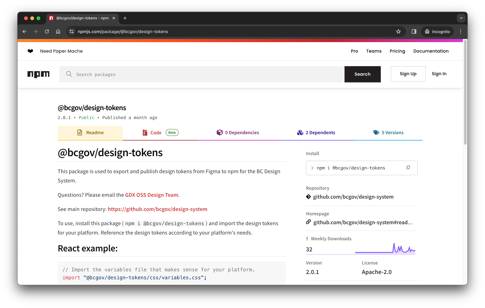

# Introducing the B.C. Design System

## Who we are

We're the [Online Service Solutions team](https://dir.gov.bc.ca/gtds.cgi?show=Branch&organizationCode=CITZ&organizationalUnitCode=GDX%2dOSS) in the Government Digital Experience (GDX) division of the Ministry of Citizens' Services. We are working on a new major version of the B.C. Design System.

## Where the design system has been

Version 1 of the system[^1] consisted of written guidance and HTML and CSS samples, hosted on DevHub. This system was an important first step to unify the look and feel of B.C. government apps and sites. The system was intended to be supported by a community contribution model.

The system gave a reference for government's digital look and feel, but it lacks critical functionality for both designers and developers.

For designers, Figma and Adobe XD prototyping libraries were supplied by the community and hosted within a GitHub repo. There was no way for local copies of the files to benefit from centralised updates. All of the design decisions in the system had to be inferred by designers as they created the new components they needed.

For developers, the HTML and CSS samples in the component library were a start — but no installable, functional components were included. This caused a lot of work for product teams to be able to leverage the design system. Each team had to start by writing their own component library in their preferred framework. 

Teams contributed back to the design system versions of the components they created for their products — but there was no central mechanism for cataloguing or supporting these libraries. Unique components added to these libraries never made it back to the central design system. If the original authors of a community library left, it could become a point-in-time artifact.

This was "hard mode": a lot of vibes-based decision-making had to happen at the product level, once teams looked at the system and saw what it offered (and didn't.)

## Where the design system is going

With the launch of the [new look and feel for gov.bc.ca](https://www2.gov.bc.ca/gov/content/home) in January, we have a new opportunity to systematise the new UI into a new B.C. Design System. The new look and feel of gov.bc.ca was the result of [extensive testing and public engagement](https://engage.gov.bc.ca/govtogetherbc/engagement/alpha-gov/).

We want to provide a more functional design system that:

* Benefits from the thorough research, design iteration and testing that went into gov.bc.ca.
* Is built on a scalable foundation suitable for long-term maintenance and evolution

For designers, we intend to publish Figma libraries that let them use our design tokens and components in their own designs and prototypes. For developers, we will publish design tokens and React components for direct use in products.

## What's available now

The first major piece of work for version 2 is a new B.C. Design Tokens library. This is a standalone release, that represents a foundation for the new design system. Design tokens represent codified, atomic design decisions.

### Design tokens library on Figma

For designers, the [B.C Design Tokens Figma community file](https://www.figma.com/community/file/1326994583954765832) contains variables and styles, along with documentation for their use.

## Installable package on npm

For developers, the [@bcgov/design-tokens npm package](https://www.npmjs.com/package/@bcgov/design-tokens) can be installed into your app or component library as a dependency.

The big idea with design tokens is to improve the designer and developer experience by providing a direct connection in their work. Designers can use the tokens in their Figma designs, with developers able to see which tokens are used where in generated code. Then, developers can use the corresponding design tokens variables in their code. By using these central sources of truth, teams can benefit from updates to the Figma community file or npm package. Teams choose when to update their version of the design tokens.

## What's coming

We're now working on building out the UI component library that's at the heart of the new design system. This includes:

* A full design library in Figma
* A React component library
* A documentation hub on gov.bc.ca 

Our goal is to get to a point where teams can use our components directly in both their Figma designs and their React applications.[^2]

You can check out an early preview version of our React component library in our [@bcgov/design-system-react-components npm package](https://www.npmjs.com/package/@bcgov/design-system-react-components).

## Can you help?
Our view is that a design system needs active, long-term stewardship — but that doesn't mean we want to take a top-down approach without consultation and contribution from the community. We don't yet know what our contribution model and processes will look like (but we're working on it!)

Resourcing is the biggest bottleneck we face in delivering the new design system. Can you please donate some designers and developers to our cause? No, seriously. Email <a href="mailto:DesignSystem@gov.bc.ca">DesignSystem@gov.bc.ca</a>, please.

## Footnotes
[^1]: The legacy design system is hosted on [Classic DevHub](https://classic.developer.gov.bc.ca/Design-System/About-the-Design-System)
[^2]: At this time, we're not considering support for frameworks other than React — but we're open to supporting and collaborating teams who might want to reimplement design system components in their preferred language or framework
