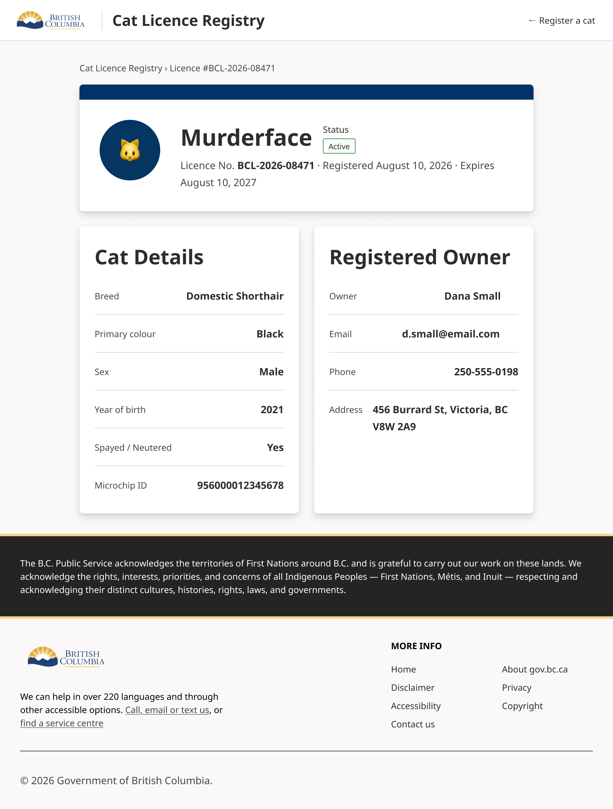

Create a React/TypeScript single page app that implements this mock-up:

- Use this directory as the root for a new Vite + React + TypeScript project. This directory is held within the B.C. Design System mono-repo, and the documentation/guidance available inside the mono-repo should be used to build the app.
- Use `@bcgov/bc-sans` as a dependency. Use the BC Sans font throughout the app.
- Use `@bcgov/design-tokens` as a dependency. Prefer the CSS tokens, proper class names, and no inline styles. Do not add additional tokens (CSS variables) unless necessary to implement the design, and if adding new tokens, do so in a clearly labeled central CSS variables file.
- Use `@bcgov/design-system-react-components` as a component library. Follow the patterns found in this library when adding new app-specific components.
  - Use the `max-width` values in the `Header` and `Footer` components with any full-width components you create. For example, don't create a card component that stretches beyond the content of the `Header`.
- Do not add any extra dependencies like Tailwind, a React router, or anything else without asking. Just implement the single screen of the mock-up.
- If any component, typography, color, or accessibility guidance is missing, treat [designsystem.gov.bc.ca](https://www2.gov.bc.ca/gov/content/digital/design-system) as a source of truth for canonical B.C. Design System information.
